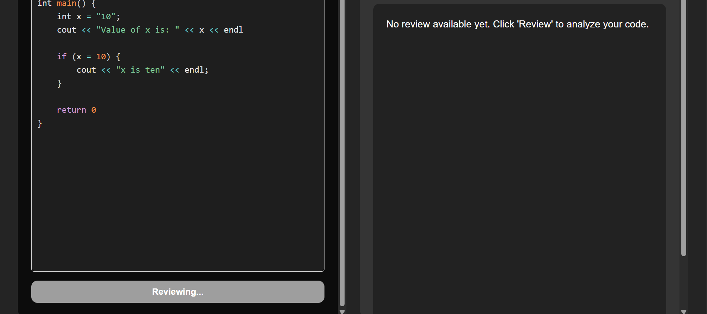

<h1>CodeScan</h1>

<h2>Getting Started</h2>

  CodeScan is an AI-powered code review tool that helps developers identify potential issues, improve code readability, and follow best practices using advanced language models.

<h3>Key Features:</h3>

  1. Built-in code editor using <code>react-simple-code-editor</code> for real-time editing with syntax support. 
  2. Intelligent syntax highlighting powered by <code>PrismJS</code> and <code>highlight.js</code>, enhancing code readability with clean themes.

<h2>Tech Stack</h2>

  <strong>Frontend:</strong> 
  • React.js (Vite) 
  • Prism.js 
  • highlight.js 
  • react-markdown 
  • rehype-highlight 
  • Axios 
  • Tailwind CSS  

  <strong>Backend:</strong> 
  • Node.js 
  • Express.js 
  • Google Generative AI API 

<h2>Clone the Repository</h2>
<pre><code>git clone https://github.com/Nishant-66/CodeScan
cd CodeScan</code></pre>

<h2>Installation</h2>
<pre><code># Backend setup
cd Backend
npm install

# Frontend setup
cd ../Frontend
npm install</code></pre>

<h2>Running the Application</h2>
<pre><code># Start backend (Port 3000)
cd Backend
npm run dev

# Start frontend (Port 5173)
cd ../Frontend
npm run dev</code></pre>

  Backend → <a href="http://localhost:3000">http://localhost:3000</a> 
  Frontend → <a href="http://localhost:5173">http://localhost:5173</a>

<h2>Screenshots</h2>

